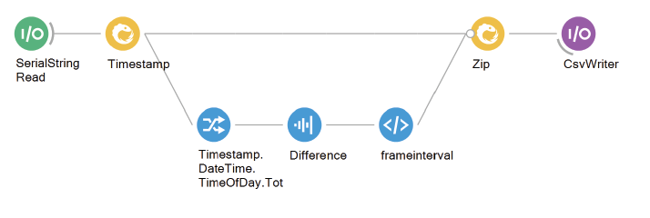

# NL-glow-worm
A tracking and stimulation system for glow worms

## Aims
This set-up was design to investigate male glow-worms attraction to a stimulus that mimics the females' glow. The aim was to be able to do so in tethered animals, whose behavior could be recorded at all times. Furthermore, we intended to have the ability to fully control the stimulus position relative to the glow-worm, as well as other characteristics such as intensity (brightness) and the duration of presentation.

## Methodology

The tracking system was designed for tethered male glow-worms. Insects were fixed on top of a walking platform, which consisted in a light polystyrene ball that seated on top of a cup shape structure. The cup was perforated at the centre, allowing for air flow to be pumped through. Thus, the light ball was supported by an air cushion and could, with very little friction, rotate as the glow-worm walked. The movements of the ball, and thus the fictive path of the glow-worm, were recorded by two optical mice sensors, placed close to the ball and orthogonally to each other. The optical mice x and y velocities were recorded by a computer, and were then analyzed in terms of translational and angular distance and velocity. 

The stimulus consisted on LEDs with similar wavelength as the female glow, displayed as an array that surrounded ~ 180° of the insect's lateral visual field. The LEDs were attached to a controller and their intensity and duration of presentation controlled and recorded.

**Figure 1: Schematics of trackball and stimulation set-up for glow-worms.** A tethered male glow-worm walks on top of a polystyrene ball supported by an air cushion which seats on a custom 3D printed support (gray). As the insect walks, the ball moves beneath it and its movements are recorded by two optical mice sensors (dark green). Each optical mouse is connected to an Arduino Due, in turn connected to a USB port. The glow-worm is presented with light stimuli through LEDs (light green) fixed to a custom 3D printed array (yellow) that surrounds ~ 180° of the insect's lateral visual field. The LEDs are attached to a controller, in turn connected to a USB port.

### Tethering 

Individual male glow-worms were tethered in a fixed position, not being allowed to rotate by themselves on top of the ball nor adjust their height (Figure 2A). The following material was needed for tethering:

- **Tube:** small tube (SIZE) glued to the wings, around the insect's center of mass, with rapid (5 seconds) UV glue. The tube was kept at all times and attached to the experimental apparatus for experiments.

- **Pipette tip and syringe:** cut pipette tip (SIZE) glued to the bent tip of a long syringe (SIZE), where the insect's tube could attach to.

- **Micromanipulator:** where the other end of the syringe could attach to, for allowing the experimenter to adjust the position and height of the insect on top of the ball.

### Trackball and support

The trackball system was composed of the following materials (Figure 2B,C):

- **Trackball:** polystyrene ball (5 cm diameter).

- **Support:** custom 3D printed structure ().

- **Pump, regulator and system of tubes and connectors:** the air flow was generated by a pump, regulated at about X lpm, and channeled to the support through a system of tubes od various sizes, ending with a specific connector that fits the model of the support.

**Figure 2: Detailed scheme of tethering and trackball support.** A) Male glow-worm with a tube glued to its wings, attached to the pipette tip glued to the bent end of the syringe. The syringe was attached to the micromanipulator for experiments (not shown). B) Photograph and C) Open Scad sketch of the trackball support with the real and fictive ball visible. The air flow entered through the connector on the side and passed through the opening at the center of the cup. The optical mice were fixed to the support through the portrusions on two ortogonal sides. The indents at the bottom of the support allowed for it to be mounted on a frame that kept it stable (not visible).

### Movement recordings

The walking behaviour of glow-worms was inferred by recordings of the trackball's movement. These recordings were acquired using the following hardware and software:

**Hardware**

- **Optic flow sensors:** two optical mice's (M500 Logitech) sensors and relevant circuits were detached from the remaining parts. Each was attached to a side of the trackball support, orthogonal to each other, with the sensor at the level of the ball’s equator (Figure 2B).

- **Arduino Due:** each optical mouse was connected to one Arduino Due, which in turn connected to a USB port on a computer.

**Additional recordings** 

- **Infra-red camera:** placed above the set-up and connected to the same computer via USB.  

**Software**

- **Arduino IDE (v1.8.15):** for recording the x and y velocities of the optical mice, at ~ 60 fps ().

- **Bonsai (Lopes et al., 2015):** for saving the information from the Arduinos and camera, with a time stamp per frame, in a .csv file each ().

<!-- 

**Figure 3: Bonsai project workflow for mice and camera.** -->

### Stimulus 

A light stimulus was presented to the fixed glow-worm using the following:

**Hardware**

- **LEDs:** wavelength 555 nm; 5 mm diameter.

- **LED array:** custom 3D printed semicircular structure fitting up to 9 LEDs (; Figure 3A), placed around the trackball apparatus.

- **LED controller:** custom-printed circuit board which accommodates the microcontroller, the LED driver and up to 24 LED channels (Figure 3B). You can find more detailed information on [BadenLab/LED-Zappelin](https://github.com/BadenLab/LED-Zappelin).

**Software**

- **Arduino IDE (v1.8.15):** for setting and recording the LEDs' intensity and duration ().

- **Bonsai (Lopes et al., 2015):** for saving the LED information and a time stamp per frame in a .csv file ().

**Figure 3: LED array and controller.** A) custom 3D printed array for fitting LEDs, with two side structures for mounting it on the same frame as the trackball support, arround it (not shown). B) Custom-printed circuit board which accommodates the microcontroller, the LED driver and up to 24 LED channels. 

<!-- 

**Figure 5: Bonsai project workflow for LEDs.** -->

You can find the list of hardware and software .

<!--information/link dump:  
https://www.adafruit.com/product/1356  
https://www.mouser.co.uk/ProductDetail/Lumex/SSL-LX5093PGD?qs=%2Fha2pyFaduh%252BeY3QLiqc1szK7GoZblk1b%252BVpa99b7ZsXu%2FBD2FbvvA%3D%3D  

https://scanbox.org/2014/04/23/ball-tracking/comment-page-1/  

https://www.bidouille.org/files/hack/mousecam/Understanding%20Optical%20Mice%20White%20Paper.pdf  

https://www.bidouille.org/files/hack/mousecam/Optical_Flow_OPT.pdf  

note on work in progress:

26/04/2021
Seems mouse sensors using for optical flow detection are extremelly hard to come by in small quantities. I started [this thread](https://forum.openhardware.science/t/tracking-movement-with-a-computer-mouse-help/2834) on the GOSH Forum and some people have chipped in with ideas/suggestions and resources.

In the meantime I bought a cheap Ebay mouse to take it apart and see if we could learn something from the parts/components and if it would work as well on styrofoam spheres.

## SCAD Files
Contains the trackball support SCAD file. Current version has slits for mounts. Parameters:

`diameter` Diameter of the ball. Defaults to 44mm.
 - Glow worms: 44mm
 - Beetles: 100mm
 - Wood ants: 44mm  
`height="high"/"low"` Determines if 1/2 or 1/3 of the ball is covered.  
`inlet=true/false/"only"` Whether to include an inlet which can be glued underneath the holder. 

Currently the space thickness of the sides may need to be increased to make better room for the slits.

Also scad file for LED array (LED_line) - half circunfrence, 6 cm inner diameter, 0.5 cm thickness; with two rods to glue on the side for holding and rotating if needed (0.5 cm diam, 3 cm long)

## Trackball program
A small standalone program which reads the movement of the cursor (motion in x controls rotational motion (orientation angle), changes in y translational movement). Stop the script with SPACE. Ideally integrate two ortogonal optical mouse. 

Note: Tracking ball movement with camera also possible (see links bellow for FicTrac)

## Previous studies with trackballs:

- FicTrac paper for tracking ball motion with a camera:
https://www.researchgate.net/profile/Gavin-Taylor-2/publication/260044337_FicTrac_A_visual_method_for_tracking_spherical_motion_and_generating_fictive_animal_paths/links/5daa3b78299bf111d4be68c9/FicTrac-A-visual-method-for-tracking-spherical-motion-and-generating-fictive-animal-paths.pdf

https://www.biorxiv.org/content/10.1101/2021.04.29.442008v1.full.pdf

https://www.dropbox.com/sh/5tcplzvkufx8qrj/AAAbGobTdm5zj6f1vsMPDctEa (out of date - have not found current software)

- Trackball for ants (no stimulus):
https://www.researchgate.net/profile/Hansjuergen-Dahmen/publication/313776075_Naturalistic_path_integration_of_Cataglyphis_desert_ants_on_an_air-cushioned_lightweight_spherical_treadmill/links/5992c053458515a8a24bdb66/Naturalistic-path-integration-of-Cataglyphis-desert-ants-on-an-air-cushioned-lightweight-spherical-treadmill.pdf -->
