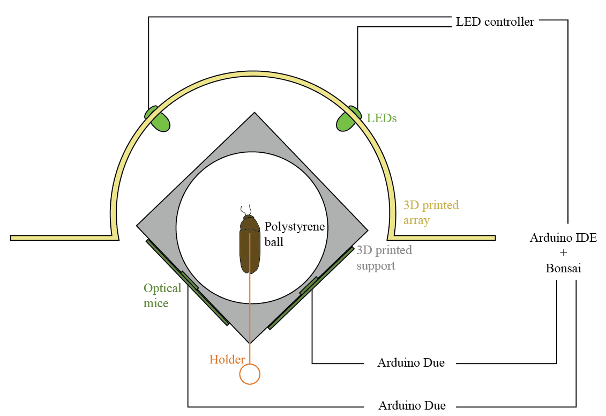
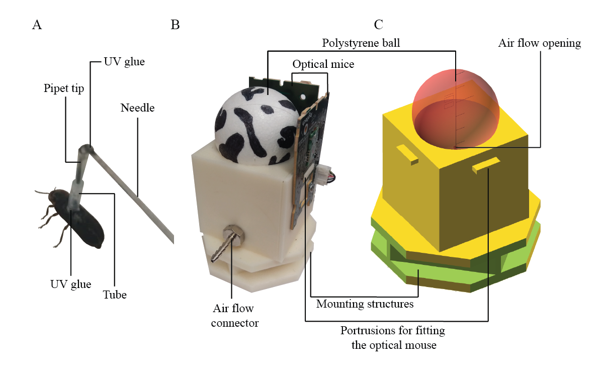
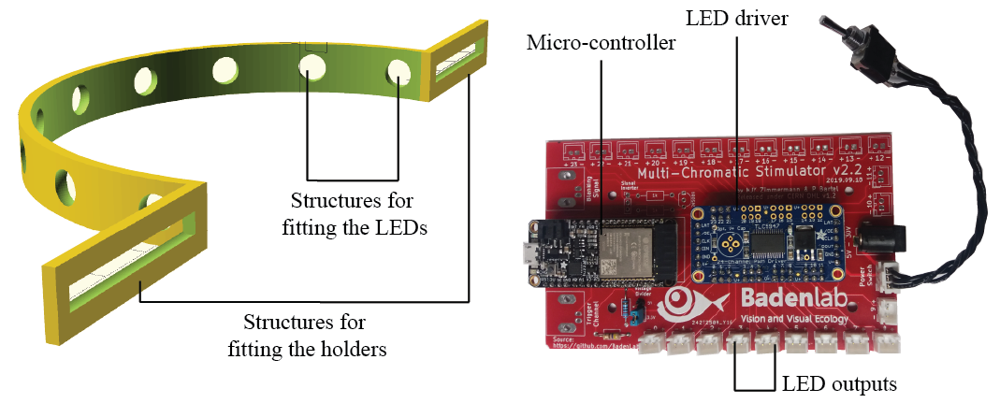
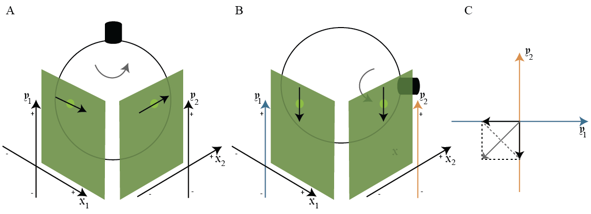

# GlowWorm_Trackball&LEDstim
A tracking and stimulation system for glow worms

    Authors: A.S.D Fernandes, E. Moubarak, A.M. Chagas & J.E. Niven
    Aknowlegements: M.J.Y. Zimmermann

## Aims
This set-up was designed to investigate male glow-worms attraction to a stimulus that mimics the females' glow. The aim was to be able to do so in tethered animals, whose behavior could be recorded at all times. Furthermore, we intended to have the ability to fully control the stimulus position relative to the glow-worm, as well as other characteristics such as intensity (brightness) and the duration of presentation.

## Methodology

Insects were fixed on top of a walking platform, which consisted in a light polystyrene ball that seated on top of a cup-shaped structure. The cup was perforated at the centre, allowing for air to be pumped through. Thus, the light ball was supported by an air cushion and could, with very little friction, rotate as the glow-worm walked. The movements of the ball, and thus the fictive path of the glow-worm, were recorded by two optical mice sensors, placed close to the ball and orthogonally to each other (Figure 1). The optical mice x and y displacements were recorded by a computer, and were then analyzed in terms of translational and angular distance and velocity. 

The stimulus consisted on LEDs with similar wavelength as the female glow, displayed as an array that surrounded ~ 180° of the insect's lateral visual field. The LEDs were attached to a controller and their intensity and duration of presentation controlled and recorded (Figure 1).

**Figure 1: Schematics of trackball and stimulation set-up for glow-worms.** A tethered male glow-worm walks on top of a polystyrene ball supported by an air cushion which seats on a custom 3D printed support (gray). As the insect walks, the ball moves beneath it and its movements are recorded by two optical mice sensors (dark green). Each optical mouse is connected to an Arduino Due, in turn connected to a USB port. The glow-worm is presented with light stimuli through LEDs (light green) fixed to a custom 3D printed array (yellow) that surrounds ~ 180° of the insect's lateral visual field. The LEDs are attached to a controller, in turn connected to a USB port. The information from the LEDs and optical mice are recorded with Arduino IDE and saved with Bonsai software.

### Tethering 

Individual male glow-worms were tethered in a fixed position, not being allowed to rotate by themselves on top of the ball nor adjust their height (Figure 2A). The following material was needed for tethering:

- **Tube:** small tube (1.02mm ID, 1.98mm OD, 5mm length) glued to the wings, around the insect's center of mass, with rapid (5 seconds) UV glue. The tube was glued to the glow-worm at all times and attached to the experimental apparatus for experiments.

- **Pipette tip and syringe needle:** cut pipette tip glued to the bent tip of a long syringe needle (length: 120 mm), where the insect's tube could attach to.

- **Micromanipulator:** where the other end of the syringe needle could attach to, for allowing the experimenter to adjust the position and height of the insect on top of the ball.

### Trackball and support

The trackball system was composed of the following materials (Figure 2B,C):

- **Trackball:** polystyrene ball (5 cm diameter).

- **Support:** custom 3D printed structure ().

- **Pump, regulator, system of tubes and connector:** the air flow was generated by a pump, regulated at about 2-5 lpm, and channeled to the support through a system of tubes of various sizes, ending with a specific connector that fits the model of the support.

**Figure 2: Detailed scheme of tethering and trackball support.** A) Male glow-worm with a tube glued to its wings, attached to the pipette tip glued to the bent end of the syringe. The syringe was attached to the micromanipulator for experiments (not shown). B) Photograph and C) Open Scad sketch of the trackball support with the real and fictive ball visible (respectively). The air flow entered through the connector on the side and passed through the opening at the center of the cup. The optical mice were fixed to the support through the portrusions on two ortogonal sides. The indents at the bottom of the support allowed for it to be mounted on a frame that kept it stable (not visible).

### Movement recordings

The walking behaviour of glow-worms was inferred by recordings of the trackball's movement. These recordings were acquired using the following hardware and software:

**Hardware**

- **Optic flow sensors:** two optical mice (M500 Logitech) sensors and relevant circuits were detached from the remaining parts. Each was attached to a side of the trackball support, orthogonal to each other, with the sensor at the level of the ball’s equator (Figure 2B).

- **Arduino Due:** each optical mouse was connected to one Arduino Due, which in turn connected to a USB port on a computer.

**Additional recordings** 

- **Infra-red camera:** placed above the set-up and connected to the same computer via USB (not shown).  

**Software**

- **Arduino IDE (v1.8.15):** for recording the x and y displacements of the optical mice, at ~ 60 fps ().

- **Bonsai (Lopes et al., 2015):** for saving the information from the Arduinos and camera, with a time stamp per frame, in a .csv file each ().

### Stimulus 

A light stimulus was presented to the fixed glow-worm using the following (Figure 3):

**Hardware**

- **LEDs:** wavelength 555 nm; 5 mm diameter.

- **LED array:** custom 3D printed semicircular structure fitting up to 9 LEDs (; Figure 3A), placed around the trackball apparatus.

- **LED controller:** custom-printed circuit board which accommodates the microcontroller, the LED driver and up to 24 LED channels (Figure 3B). You can find more detailed information on [BadenLab/LED-Zappelin](https://github.com/BadenLab/LED-Zappelin).

**Software**

- **Arduino IDE (v1.8.15):** for setting and recording the LEDs' intensity and duration ().

- **Bonsai (Lopes et al., 2015):** for saving the LED information and a time stamp per frame in a .csv file ().

**Figure 3: LED array and controller.** A) custom 3D printed array for fitting LEDs, with two side structures for mounting it on the same frame as the trackball support, arround it (not shown). B) Custom-printed circuit board which accommodates the microcontroller, the LED driver and up to 24 LED channels. 

You can find the detailed list of hardware and software .

## Data analysis

### Raw variables from the optical mice

The optical mice (Logitech M500) comprise an infrared LED, an image acquisition system (IAS) and a digital signal processor (DSP). The infrared LED light projected onto the trackball surface bounces back and is captured by the IAS, which consists in a sensor that records, in this case, around 60 images per second. As the ball near the mouse moves, these images change and this change is processed by the DPS in order to determine the direction and magnitude of the movement. Thus, the raw data obtained from the optical mice, recorded by the Arduino Due and Bonsai, were:

- **x displacement:** specifies the relative change in pixels (dots/counts) between the current and previous frames, in the horizontal axis;

- **y displacement:** specifies the relative change in pixels (dots/counts) between the current and previous frames, in the vertical axis;

- **Time:** number of microseconds that have passed from the moment the program was uploaded into the Arduino Due.

These raw values were essentially distances, in pixel units, and each frame had an associated time.

### Specific experimental variables

The variable time was normalized to start at zero, converted to seconds (not shown), and used for merging the the data from the two mice to the nearest value. The **time difference** between frames was calculated as the difference between the current frame and the previous. 

For this particular set-up, the insect was tethered on top of the trackball facing a fixed direction. As the animal turned, the ball rotated underneath it and this movement was captured by changes in the horizontal axis of the optical mice sensors. If the animal turned 360 degrees, the ball moved the correspondent value on the opposite direction. Thus, the x displacement values, in pixel units, corresponded to the full perimeter of the ball at the equator level, at which the sensors were placed (Figure 4A).

The variables calculated from the x displacement were:

- **Mean x displacement:** the negative of the mean x displacement value of the two mice;

- **Angular displacement:** Mean x displacement divided by the ball radius and multiplied by 180/pi to obtain the angle in degrees (this also corresponds to instant heading or facing angle);

- **Cumulative angular displacement:** sum of angular displacement of current and all previous frames;

- **x velocity:** Mean x displacement divided by the time difference;

- **Angular velocity:** angular displacement divided by the time difference.

As the insect walked forwards on top of the ball, the movement was captured by the changes in the vertical axis of the optical mice sensors. Because the mice were orthogonal to each other, the y displacement from one mouse (the left) was taken as x and the y displacement from the other mouse as y. The forward velocity was calculated as the hypotenuse between the two sides (Figure 4B). Either mouse's y displacement could correspond to x or y.

The variables calculated from the y displacement were:

- **Forward displacement:** the squared root of the sum of the squared y displacement from one mouse and the squared y displacement of the other;

- **Cumulative forward displacement:** sum of forward displacement of current and all previous frames;

- **Forward velocity:** forward displacement divided by the time difference.

Lastly, the error between the two mice was calculated as the difference between their x displacement values, which should be the same if no error occurred.

**Figure 4: Movement direction and corresponding variables from optical mice.** A) Turning movement corresponds to rotation of the ball on the horizontal axis of the optical mice and, consequently, change in their x displacement values. The x displacement from both mice should have the same value if no recording error occured. B) Walking forward corresponds to rotation of the ball on the vertical axis of the optical mice and, consequently, change in their y displacement values. C) The real forward displacement is a combination of the y displacement values from both mice which, because they are ortogonal to each other, can be calculated as the hypotenuse between the two vectors.

## Calibration of the optical mice

### Stepper motor program

The calibration was performed using a stepper motor, controlled by an Arduino Uno. A custom 3D printed ball, of the same diameter of the polystyrene ball (5 cm), was attached to the motor and positioned on top of the trackball support. 

The motor and ball were aligned with the mice to create a fictive reading for:

- rotation on top of the ball (Figure 4A);

- translation forward (axis between the two mice; Figure 4B);

- translation to the left (aligned with the mouse on the right);

- translation to the right (aligned with the mouse on the left).

The motor and ball rotated 360 degrees 15 times, each time with a different speed, for each of the fictive readings.

### Calibration factor

The calibration factor was calculated by dividing the real distance moved, which corresponded to 15 times the perimeter of the ball at the equator (2 * pi * ball radius), by the mouse recorded total distance (x displacement and y displacement).

The calibration factor was very similar between the 4 tests, with a mean of 0.0291947 +/- 7.773015^{-4}.

This value must be multiplied by the x and y displacement from the mouse to get these and remaining variables in real distance and velocity values. This distance is in the unit specified in the ball radius (mm/cm and mm^2/cm^2, respectively).

You can find some semi-edited data from the trackball calibration .

