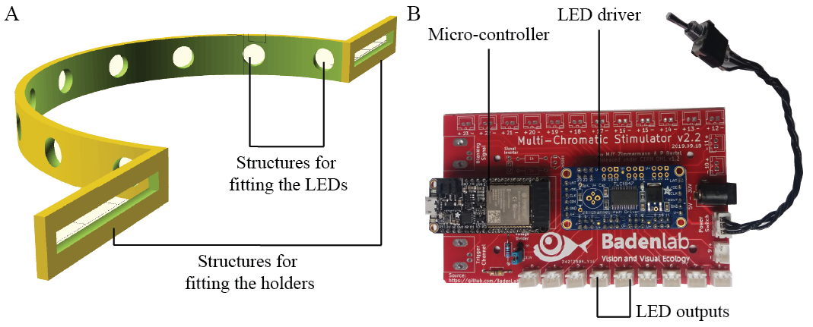

# NL-glow-worm
A tracking and stimulation system for glow worms

### Summary
This set-up was design to investigate male glow-worms attraction to a stimulus that mimics the female’s glow. The aim was to be able to do so in tethered animals, whose behavior can be recorded at all times. Furthermore, we intended to have the ability to fully control the stimulus position relative to the glow-worm, as well as other characteristics such as intensity (brightness) and the duration of presentation.

**Figure 1: Schematics of trackball and stimulation set-up for glow-worms.** The set-up consists in a tethered male glow-worm, walking on top of a polystyrene ball supported by an air cushion on top of a custom 3D printed support (gray). As the insect walks, the ball moves beneath it and its movements are recorded by two optical mice sensors (dark green), placed close to the ball and orthogonally to each other. Each optical mouse is connected to an Arduino Due, in turn connected to a USB port. The optical mice x and y velocities are recorded by the computer, which are then analyzed in terms of translational and angular velocities. The stimulus consists on LEDs with similar wavelength as the female glow (light green), fixed to a custom 3D printed array (yellow) that surrounds ~ 180° of the insect's lateral visual field. The LEDs are attached to a controller and their intensity and duration of presentation can be controlled and recorded.

### Tethering 

Individual male glow-worms were tethered in a fixed position, not being allowed to rotate by themselves on top of the ball nor adjust their height (Figure 2A).

- **Micromanipulator:** for allowing the experimenter to adjust the position and height of the insect on top of the ball.

- **Syringe:** part of the therering system that connects to the micromanipulator.

- **Pipete tip:** glued to the tip of the syringe.

- **Tube:** diameter = ; length = ; glued to the wings, around the center of mass; connects to the pipete tip.

### Trackball and support

- **Trackball:** Polystyrene ball with 5 cm diameter.

- **Support:** Custom 3D printed structure ( ; Figure 2B,C).

- **Air flow:** Generated by a pump and regulated at about X lpm; connected to the support by a system of tuped and connectors.

**Figure 2: Detailed scheme of tethering and trackball support.** A) Male glow-worm with a tube glued with rapid dry (5 seconds) UV glue to its wings. Insects keep the tube at all times and the tube is connected to the pipete tip for experiments. The pipete tip is glued to the end of the syringe and the syringe attached to a micromanipulator (not shown). B) Photograph and C) Open Scad sketch of the trackball support with the real and fictive ball visible. The support has a cup shape that covers the lower third of the ball and an opening at the center of the cup from which the air passes through. The other end of the air flow opening (not visible) is connected to a the pump through a system of tubes and connectors. Two sides of the support have protrusions for fixing the optical mice.

### Movement recordings

**Hardware**

- **Optic flow sensors:** Two optical mice (M500 Logitech, Lausanne, Switzerland) with sensors and relevant circuits detached from the remaining parts. The optical mice were placed orthogonally, with the sensor at the level of the ball’s equator and attached to the support with a screw (Figure 2B).

- **Arduino Due:** Each optical mouse was connected to one Arduino Due, which in turn connected to a USB port on a computer. 

**Software**

- **Arduino IDE (v1.8.15):** For recording the x and y velocities of the optical mice, at ~ 60 fps ().

- **Bonsai (Lopes et al., 2015):** For saving the information from the arduinos and a time stamp per frame in a .csv file (Figure 3).

**Additional recordings** 

- **Infra-red camera (ELP-USBFHD05MT-RL36-U, SHENZHEN AILIPU TECNHOLOGY CO.,LTD, China):** Placed above the set-up; connected to a computer via USB; recordings performed using Bonsai, which created a .avi file and a .csv with the time stamp of every frame.

**Figure 3:** Bonsai project workflow for mice and camera

Code 1: Arduino IDE mouse readings

### Stimulus 

**Hardware**

- **LEDs:** Wavelength 555 nm; 5 mm diameter.

- **LED array:** Custom-made 3D printed semicircular structure fitting up to 9 LEDs (; Figure 4A).

- **LED controller:** Custom-printed circuit board which accommodates the microcontroller, the LED driver and up to 24 LED channels (Figure 4B).

**Software**

- **Arduino IDE (v1.8.15):** For setting and recording LEDs' intensity and duration ().

- **Bonsai (Lopes et al., 2015):** For saving the LED information and a time stamp per frame in a .csv file (Figure 5).

**Figure 4:** LED array and controller

**Figure 5:** Bonsai project workflow for LEDs

### List of material

a	b	c
1	3	5
2	4	6

<!--information/link dump:  
https://www.adafruit.com/product/1356  
https://www.mouser.co.uk/ProductDetail/Lumex/SSL-LX5093PGD?qs=%2Fha2pyFaduh%252BeY3QLiqc1szK7GoZblk1b%252BVpa99b7ZsXu%2FBD2FbvvA%3D%3D  

https://scanbox.org/2014/04/23/ball-tracking/comment-page-1/  

https://www.bidouille.org/files/hack/mousecam/Understanding%20Optical%20Mice%20White%20Paper.pdf  

https://www.bidouille.org/files/hack/mousecam/Optical_Flow_OPT.pdf  

note on work in progress:

26/04/2021
Seems mouse sensors using for optical flow detection are extremelly hard to come by in small quantities. I started [this thread](https://forum.openhardware.science/t/tracking-movement-with-a-computer-mouse-help/2834) on the GOSH Forum and some people have chipped in with ideas/suggestions and resources.

In the meantime I bought a cheap Ebay mouse to take it apart and see if we could learn something from the parts/components and if it would work as well on styrofoam spheres.

## SCAD Files
Contains the trackball support SCAD file. Current version has slits for mounts. Parameters:

`diameter` Diameter of the ball. Defaults to 44mm.
 - Glow worms: 44mm
 - Beetles: 100mm
 - Wood ants: 44mm  
`height="high"/"low"` Determines if 1/2 or 1/3 of the ball is covered.  
`inlet=true/false/"only"` Whether to include an inlet which can be glued underneath the holder. 

Currently the space thickness of the sides may need to be increased to make better room for the slits.

Also scad file for LED array (LED_line) - half circunfrence, 6 cm inner diameter, 0.5 cm thickness; with two rods to glue on the side for holding and rotating if needed (0.5 cm diam, 3 cm long)

## Trackball program
A small standalone program which reads the movement of the cursor (motion in x controls rotational motion (orientation angle), changes in y translational movement). Stop the script with SPACE. Ideally integrate two ortogonal optical mouse. 

Note: Tracking ball movement with camera also possible (see links bellow for FicTrac)

## Previous studies with trackballs:

- FicTrac paper for tracking ball motion with a camera:
https://www.researchgate.net/profile/Gavin-Taylor-2/publication/260044337_FicTrac_A_visual_method_for_tracking_spherical_motion_and_generating_fictive_animal_paths/links/5daa3b78299bf111d4be68c9/FicTrac-A-visual-method-for-tracking-spherical-motion-and-generating-fictive-animal-paths.pdf

https://www.biorxiv.org/content/10.1101/2021.04.29.442008v1.full.pdf

https://www.dropbox.com/sh/5tcplzvkufx8qrj/AAAbGobTdm5zj6f1vsMPDctEa (out of date - have not found current software)

- Trackball for ants (no stimulus):
https://www.researchgate.net/profile/Hansjuergen-Dahmen/publication/313776075_Naturalistic_path_integration_of_Cataglyphis_desert_ants_on_an_air-cushioned_lightweight_spherical_treadmill/links/5992c053458515a8a24bdb66/Naturalistic-path-integration-of-Cataglyphis-desert-ants-on-an-air-cushioned-lightweight-spherical-treadmill.pdf -->
